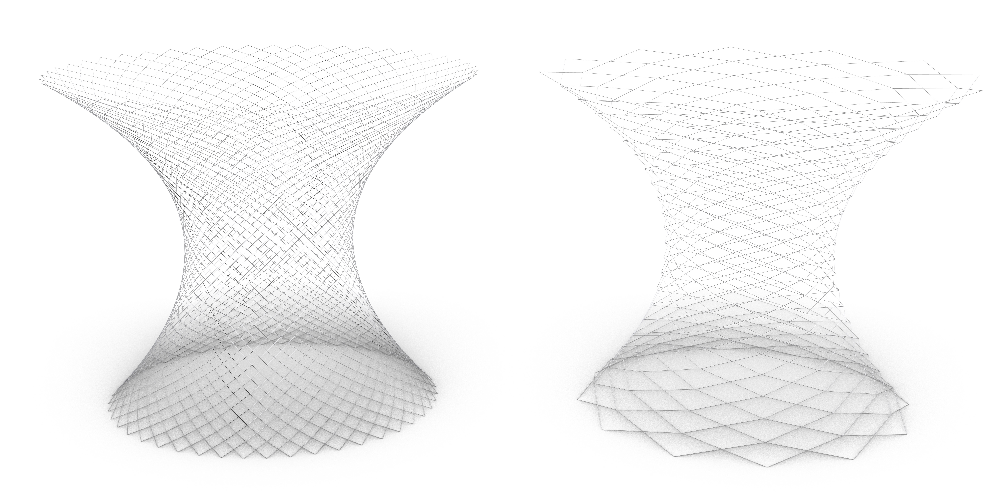

This repository consists of Grasshopper scripts used to make parametric structures of various shapes and sizes.Every folder has multiple scripts to derieve same output but using different techniques and methods.

## (https://github.com/sanatladkat/RhinoGH/tree/main/Pylon)

